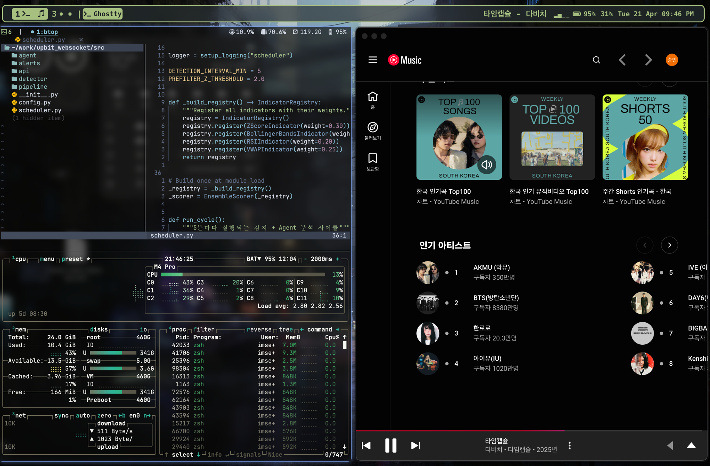

# sml1323 dotfiles

macOS 개인 dotfiles. 여러 공개 dotfiles 저장소에서 **차용한 베이스** 위에 **개인 오버라이드**를 올리는 구조.



## 현재 적용 스택

| 도구 | 베이스 | 개인 오버라이드 |
|------|--------|----------------|
| Ghostty | (없음, 직접 작성) | [`overrides/ghostty/config`](overrides/ghostty/config) — dark glass (hendriknielaender 스타일 참고) |
| zsh | [hendrikmi/dotfiles](https://github.com/hendrikmi/dotfiles) 심링크 | [`overrides/zsh/custom.zsh`](overrides/zsh/custom.zsh), [`aliases.zsh`](overrides/zsh/aliases.zsh) — Python/Node 스택 조정, 개인 env vars 추가 |
| starship | hendrikmi 심링크 | (없음) |
| tmux | hendrikmi 심링크 | (없음) |
| nvim (hendrikmi) | hendrikmi 심링크 (default) | `init.lua`/`debug.lua` 로컬 수정 + [`overrides/nvim/after/ftplugin`](overrides/nvim/after/ftplugin) — wezterm preview off, dap-python Python 경로 명시, bufferline 활성화, markdown/text wrap |
| nvim (LazyVim) | `nvim-lazyvim` APPNAME 격리 유지 | [`overrides/nvim-lazyvim/plugins/vim-tmux-navigator.lua`](overrides/nvim-lazyvim/plugins/vim-tmux-navigator.lua), [`overrides/nvim-lazyvim/after/ftplugin`](overrides/nvim-lazyvim/after/ftplugin) |
| yazi | hendrikmi 심링크 | (없음) |
| VSCode | hendrikmi 심링크 | (없음) |
| karabiner | **미적용** (한영 Caps Lock 충돌) | — |
| AeroSpace | [manishprivet](https://www.manishk.dev/blogs/macos-ricing-setup/) 참고 | [`overrides/aerospace/aerospace.toml`](overrides/aerospace/aerospace.toml) — 크로스 모니터 포커스, 갭 조정 |
| SketchyBar | manishprivet 참고 | [`overrides/sketchybar/`](overrides/sketchybar/) — YouTube Music, WiFi RSSI 바, Hack Nerd Font |
| JankyBorders | manishprivet 참고 | [`overrides/borders/bordersrc`](overrides/borders/bordersrc) — 파란 glow 테두리 |

## 차용 출처 (Credits)

- **[hendrikmi/dotfiles](https://github.com/hendrikmi/dotfiles)** — zsh · tmux · starship · nvim · yazi · vscode의 베이스 전부. Nord 테마.
- **[hendriknielaender/.dotfiles](https://github.com/hendriknielaender/.dotfiles)** — Ghostty의 투명 dark glass 스타일 참고 (`background-opacity`, `blur`).

## 저장소 구조

```
overrides/        # 내 개인 파일만 (hendrikmi 등 원본은 clone해서 심링크)
├── ghostty/
├── zsh/
├── nvim/after/ftplugin/
├── nvim-lazyvim/
├── aerospace/            # AeroSpace 타일링 WM
├── borders/              # JankyBorders 창 테두리
└── sketchybar/           # SketchyBar 상태바

docs/
├── setup-guide.md        # 현재 상태 전체 가이드
├── keys-cheatsheet.md    # nvim + tmux 키 치트시트
└── ricing-cheatsheet.md  # AeroSpace + SketchyBar + JankyBorders 키/설정

assets/
└── screenshot.png        # 현재 데스크탑 스크린샷

sources/          # 차용한 각 repo의 출처/라이선스 기록
backgrounds/      # 터미널 배경 이미지
install.sh        # 새 머신 초기 설치 스크립트
```

## 새 머신에서 설치

```bash
git clone https://github.com/sml1323/dotfiles.git ~/dotfiles
cd ~/dotfiles
./install.sh
```

자세한 절차는 [`docs/setup-guide.md`](docs/setup-guide.md) 참고.

## 주요 단축키

[`docs/keys-cheatsheet.md`](docs/keys-cheatsheet.md) — nvim, tmux, 기타 키맵 모음.

## 백업 이력

도입 전 기존 설정은 `~/dotfiles-backup-20260418/`에 보관 중 (이 저장소에 포함 안 됨).

## 라이선스

개인 설정 파일 모음이라 특정 라이선스 안 붙임. 차용한 부분은 원 저장소의 라이선스 따름.
